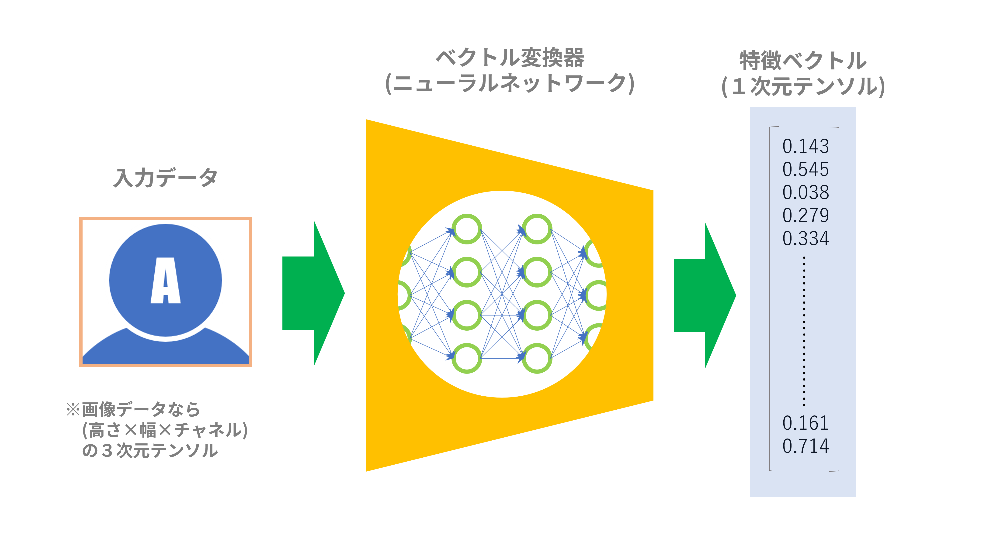
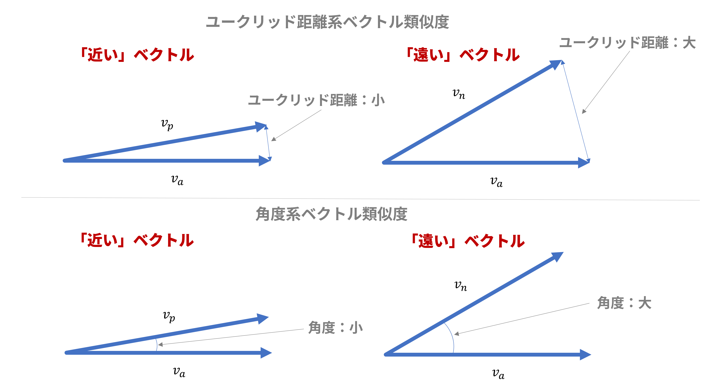
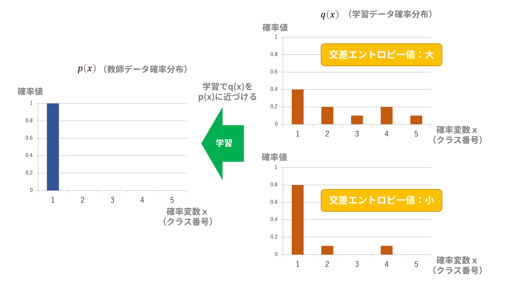
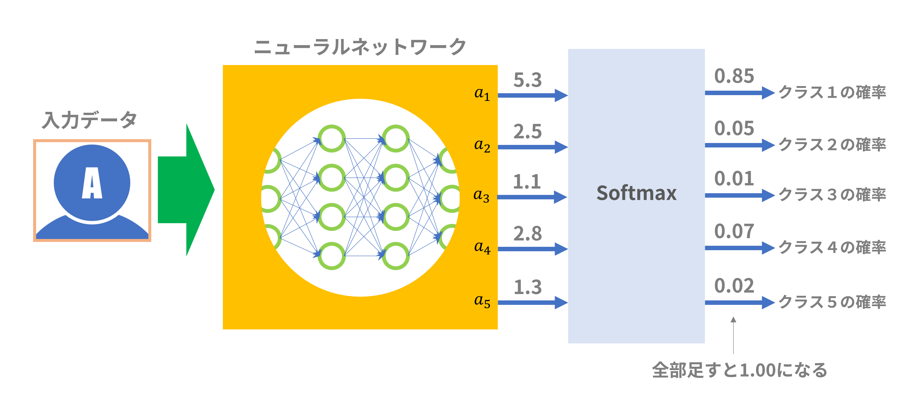
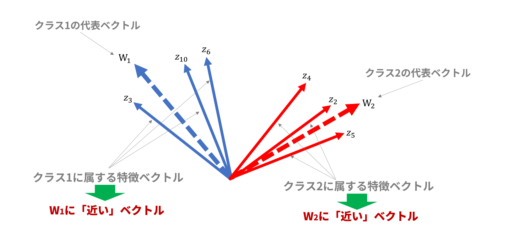
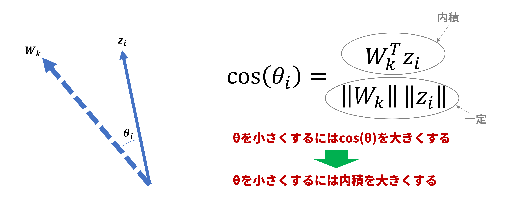
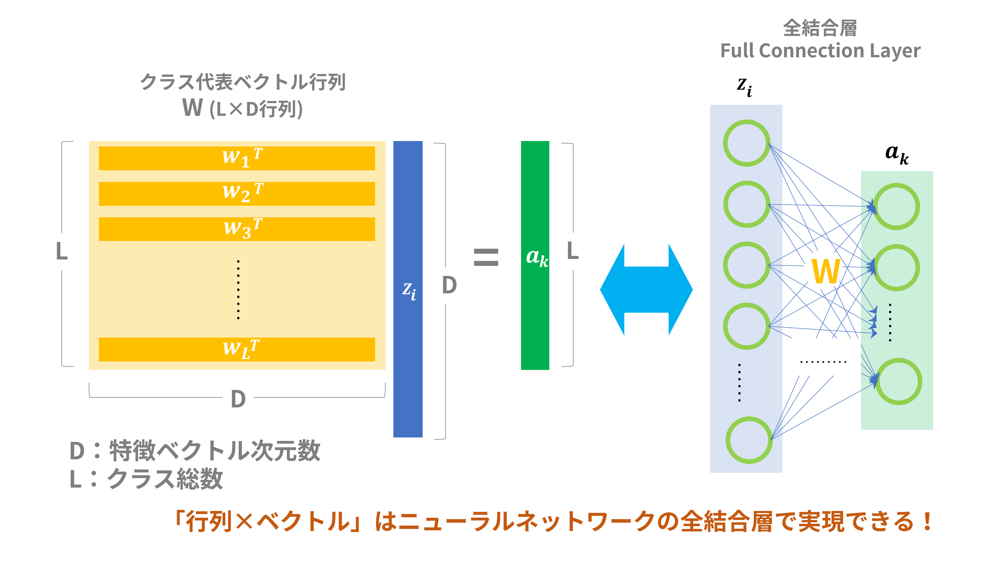
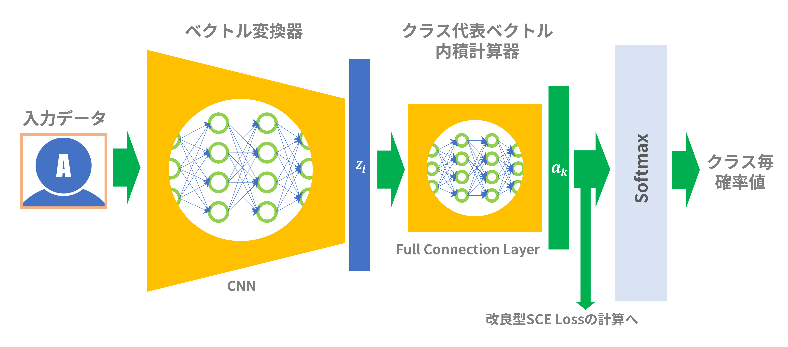

# よくわかる角度系深層距離学習～前編

以前のブログ記事「Edge TPUで顔認証してみる」では、「FaceNet」と呼ばれる顔認識用のニューラルネットワークモデルを使用しましたが、その識別能力の高さにはビックリでした。
FaceNetはいわゆる深層距離学習(Deep Metric Learning: DML)を用いたニューラルネットワークモデルです。
そこで深層距離学習について調べたところ、角度系深層距離学習というのがちょっと前に流行ったらしいことが判明したので、本記事ではその内容をわかりやすく説明したいと思います。

## １．深層距離学習(Deep Metric Learning)とは

### （１）深層距離学習とはどんな学習か？

深層距離学習を特徴付ける”仕掛け”はベクトル変換器です（「ベクトル変換器」は筆者が便宜的に名付けただけで一般的な用語ではありません）。これは、データ（たいていは画像データですが）を入力すると、特徴ベクトル（１次元テンソル）を出力するものです。「深層」を銘打っているのでこの変換器はニューラルネットワークを使います。入力したデータは何でもベクトルデータにして、後でお互いの距離を測るのに使おうというわけです。

>
図１：ベクトル変換器

一般的な深層距離学習は、このベクトル変換器を使って以下のような手順で学習します：

1. 複数クラスにクラス分けされた学習データを用意する。
2. 全データの中から２つのデータを取り出す。
3. ２つのデータを別々に同一のベクトル変換器（ニューラルネットモデル）に通して、各々の特徴ベクトルを得る。
4. ２つの特徴ベクトルが同じクラスに属していれば(positive)、２つの特徴ベクトルが**「近く」**なるようにベクトル変換器のパラメータを変える。２つの特徴ベクトルが異なるクラスに属していれば(negative)、２つの特徴ベクトルが**「遠く」**なるようにベクトル変換器のパラメータを変える。
5. 学習が収束するまで2～4を繰り返す。

### （２）ベクトルの「近さ・遠さ」とは？

２つのベクトルの「近さ・遠さ」の測り方はざっくり言って以下の２つのがあります：

* ユークリッド距離で測る：図１（上）のように２つのベクトル間のユークリッド距離が小さくなるほど「近く」、大きくなるほど「遠く」なります。
* 角度で測る：図１（下）のように２つのベクトル間の角度が小さくなるほど「近く」、大きくなるほど「遠く」なります。

>
図２：ベクトルの「近さ・遠さ」の測り方

### （３）深層距離学習の分類とその経緯

特徴ベクトル間の「近さ・遠さ」を測る方式によって、学習方式は表１の２種類の分類名に大別できます。分類名は一般的な呼称ではなく、筆者が便宜的に名付けたものです。

>
表１：深層距離学習の分類

|分類名|方式名|論文発表年|損失関数|
|:---|:---|:---|:---|
|ユークリッド距離系|Siamese Network[[1]](http://yann.lecun.com/exdb/publis/pdf/chopra-05.pdf) |2005|Contrastive Loss|
|ユークリッド距離系|FaceNet[[2]](https://arxiv.org/abs/1503.03832)|2015|Triplet Loss|
|角度系|SphereFace[[3]](https://arxiv.org/abs/1704.08063)|2017|改良型Sofmax Cross Entropy(SCE) Loss|
|角度系|CosFace[[4]](https://arxiv.org/abs/1801.09414)|2018|改良型Sofmax Cross Entropy(SCE) Loss|
|角度系|ArcFace[[5]](https://openaccess.thecvf.com/content_CVPR_2019/papers/Deng_ArcFace_Additive_Angular_Margin_Loss_for_Deep_Face_Recognition_CVPR_2019_paper.pdf)|2019|改良型Sofmax Cross Entropy(SCE) Loss|

上記分類は非常にざっくりしたものです。上記に加えて、ユークリッド距離系から角度系への橋渡しとなった方式：Center Loss[[6]](https://ydwen.github.io/papers/WenECCV16.pdf)(2016年)や、より最新の方式：AdaCos[[7]](https://arxiv.org/pdf/1905.00292.pdf)(2019年)、Circle Loss[[8]](https://arxiv.org/pdf/2002.10857.pdf)(2020年)、MagFace[[9]](https://openaccess.thecvf.com/content/CVPR2021/papers/Meng_MagFace_A_Universal_Representation_for_Face_Recognition_and_Quality_Assessment_CVPR_2021_paper.pdf)(2021年)等々があるようですがここでは割愛致します。

2016年あたりまでは損失関数としてTriplet Lossを用いたユークリッド距離系が流行っていたようですが、この方式は有効な学習データの選択が難しいという欠点もありました。
一方、2017年あたりからは損失関数としてSofmax Cross Entropy(SCE) Lossの改良型を用いた角度系が流行ります。角度系は一般的な「クラス分類」方式に基づくもので、ユークリッド距離系の欠点である「学習データの選択が難しい」という問題点がありません。つまり、通常のクラス分類学習のように学習データを流し込めば、そのまま距離学習も出来てしまうという便利さがあります。通常の「クラス分類学習」のどこに「距離学習」が絡むのかということは後述します。

つい最近までは角度系の方がユークリッド距離系よりも性能的（精度とか）に優れているという見方が多かったのですが、昨年(2020年)
、厳密な比較をした結果、どちらもたいして差がなかったという論文が出ました[[10]](https://arxiv.org/pdf/2003.08505.pdf)。また、Kaggleにおいても上位陣では角度系の使用が多いものの、ユークリッド距離系もしっかり上位に食い込んでいるという記事があります[[11]](https://hav4ik.github.io/articles/deep-metric-learning-survey)。この記事では、教師なし学習（未学習のデータでもクラスタリングできる）では依然としてユークリッド距離系は手堅い選択肢であるとしています。結局、どちらの学習方法でもそれほど優劣は無く、状況に応じて使い分けるのが吉（きち）ということのようです。

ちなみに、記事[[11]](https://hav4ik.github.io/articles/deep-metric-learning-survey)は「深層距離学習(Deep Metric Learning)」についてとてもよくまとまっています。興味のある方はぜひご覧ください。

>参考文献：
>[1] [Learning a Similarity Metric Discriminatively, with Application to Face Verification.](http://yann.lecun.com/exdb/publis/pdf/chopra-05.pdf)
>[2] [FaceNet: A Unified Embedding for Face Recognition and Clustering.](https://arxiv.org/abs/1503.03832)
>[3] [SphereFace: Deep Hypersphere Embedding for Face Recognition.](https://arxiv.org/abs/1704.08063)
>[4] [CosFace: Large Margin Cosine Loss for Deep Face Recognition.](https://arxiv.org/abs/1801.09414)
>[5] [ArcFace: Additive Angular Margin Loss for Deep Face Recognition.](https://openaccess.thecvf.com/content_CVPR_2019/papers/Deng_ArcFace_Additive_Angular_Margin_Loss_for_Deep_Face_Recognition_CVPR_2019_paper.pdf)  
>[6] [A Discriminative Feature Learning Approach for Deep Face Recognition.](https://ydwen.github.io/papers/WenECCV16.pdf)
>[7] [Adacos: Adaptively scaling cosine logits for effectively learning deep face representations.](https://arxiv.org/pdf/1905.00292.pdf)
>[8] [Circle loss: A unified perspective of pair similarity optimization.](https://arxiv.org/pdf/2002.10857.pdf)
>[9] [Magface: A universal representation for face recognition and quality assessment.](https://openaccess.thecvf.com/content/CVPR2021/papers/Meng_MagFace_A_Universal_Representation_for_Face_Recognition_and_Quality_Assessment_CVPR_2021_paper.pdf)
>[10] [A Metric Learning Reality Check](https://arxiv.org/pdf/2003.08505.pdf)
>[11] [Deep Metric Learning: a (Long) Survey](https://hav4ik.github.io/articles/deep-metric-learning-survey)

## ２．「Sofmax Cross Entropy(SCE) Loss」を理解する

角度系の理解には、その損失関数である「Sofmax Cross Entropy(SCE) Loss」（以下「SCE Loss」)
の意味を理解することが不可欠です。上記の角度系論文でも損失関数としてSCE Lossを改良したものがほとんどです。しかし、いろいろな記事を読んでもどうもピンとこなかったので、自分なりの解釈をここで説明したいと思います

### （１）これが基本形

SCE Lossは以下の式で表されます。この式の意味を順を追って説明します。

$$\mathcal{L}_{Softmax}=-\frac{1}{N}\sum\limits_{i=1}^Nlog(\frac{e^{W_{y_i}^Tz_i+b_{y_i}}}{\sum_{j=1}^Le^{W_j^Tz_i+b_j}})$$

|記号|定義|説明|
|:---|:---|:---|
|$\mathcal{L}_{Softmax}$|Sofmax Cross Entropy Loss||
|$N$|バッチサイズ|1バッチに含まれる入力データ数|
|$L$|全クラス数|
|$z_i$|特徴ベクトル|入力データをベクトル変換器に通して得られたベクトル（1次元テンソル）|
|$y_i$|所属クラス|入力データが属するクラス。例えば$L=5$ならば１~５いずれかの整数となる|
|$W_k^T$|クラス$k$の代表ベクトル|各クラスの中心となる仮想的なベクトル。$T$は転置の意。詳細は後述|

### （２）交差エントロピー（Cross Entropy）

SCE Lossは交差エントロピーに基づく損失関数です。交差エントロピーは多クラス分類にてよく用いられ、入力されたデータが属するクラスの確率を計算するのに使われます（クラス１の確率が85%、クラス２の確率が5%、クラス３の確率が・・・という塩梅）。交差エントロピー式（離散）は以下の通りです：

$$
H(p,q)=-\sum\limits_xp(x)log(q(x))
$$

|記号|定義|説明|
|:---|:---|:---|
|$H(p,q)$|交差エントロピー|確率密度関数$p(x)$と$q(x)$の交差エントロピー|
|$x$|確率変数（の実現値）|ここではクラス番号を意味する。クラスが５つあれば１~５いずれかの整数となる|
|$p(x)$|真の離散確率分布|教師データ、つまり正解データの確率分布|
|$q(x)$|推定した離散確率分布|学習データをニューラルネットワークに通した結果として得られた確率分布|

交差エントロピー$H(p,q)$は、**確率分布$p(x)$と$q(x)$が似ていれば小さく**なり、逆に**$p(x)$と$q(x)$が似ていなければ大きく**なります。
ここで、$p(x)$は教師データの確率分布、$q(x)$は学習データをニューラルネットワークに通した結果として得られた確率分布と定義します。
損失関数として交差エントロピーを用いて学習すれば、損失関数を減少させるように学習が進むので、これは学習データで計算された確率分布が教師データの確率分布に近付くことを意味します（図３）。

>
図３：交差エントロピー説明

多クラス分類で交差エントロピーを計算する場合、例えば図３における教師データ確率分布$p(x)$は以下のようになります：

$$p(x=1)=1, p(x=2)=0, p(x=3)=0, p(x=4)=0, p(x=5)=0$$

つまり、正解クラス番号（図３の場合は「１」）の確率値が「1」、正解以外のクラス番号の確率値が「0」になるという特徴があります。
したがって、交差エントロピー$H(p,q)$は以下のように再計算されます：

$$
\begin{split}
H(p,q)&=-\sum\limits_xp(x)log(q(x))\\
&=-\{1\cdot log(q(x=1))+0\cdot log(q(x=2))+0\cdot log(q(x=3))+0\cdot log(q(x=4))+0\cdot log(q(x=5))\}\\
&=-log(q(x=1))
\end{split}
$$

$q(x=1)$は$q(x)$でクラス番号が１である確率値です。$p(x)$は1か0で確定しているで、シグマが消滅して随分簡単な形になりました。これをSCE Loss式に当てはめると以下のようになります：

$$
\mathcal{L}_{Softmax}=-\frac{1}{N}\sum\limits_{i=1}^Nlog(\frac{e^{W_{y_i}^Tz_i+b_{y_i}}}{\sum_{j=1}^Le^{W_j^Tz_i+b_j}})=\frac{1}{N}\sum\limits_{i=1}^N(-log(\frac{e^{W_{y_i}^Tz_i+b_{y_i}}}{\sum_{j=1}^Le^{W_j^Tz_i+b_j}}))=\frac{1}{N}\sum\limits_{i=1}^N(-log(q(x=y_i)))
$$

ここで：

$$
q(x=y_i)=\frac{e^{W_{y_i}^Tz_i+b_{y_i}}}{\sum_{j=1}^Le^{W_j^Tz_i+b_j}}
$$

$q(x=y_i)$ではクラス番号が$y_i$での確率値（詳細は後述）が計算されています。$y_i$は入力データが属するクラスのクラス番号です。
**SCE Lossは１バッチで用いられた学習データ毎に計算された交差エントロピーの平均値**ということになります。

ちなみに交差エントロピー$H$と推定した確率$q(x)$の関係をグラフ化したのが図４です。$q(x)$は確率値なので0~1の値しかとりませんが、グラフによれば$q(x)$が1に近付くほど$H$は0に近付きます。したがって、**SCE Lossを減少させるには$q(x=y_i)$が1に近付くように学習させればよい**ことがわかります。まあ、これは結局、図３の説明と半分同じことを言っているわけですが。

の関係")
>
図４：交差エントロピーとq(x)の関係

### （３）Softmax関数

上記交差エントロピーの計算で用いる**$q(x)$は「確率分布」**である必要があります。そこで、多クラス分類で用いられるニューラルネットの最終段出力を確率値に変換する方法としてSoftmax関数がよく用いられます。
Softmax関数の式は以下の通りです：
$$
softmax(a_k)=\frac{e^{a_k}}{\sum_{j=1}^Le^{a_j}}
$$

ここで、$a_k$はニューラルネットの最終段出力においてクラス$k$に対応する出力値となります。確率分布として扱うには各クラスに対応する出力の総和が「1」とならなければなりません（図５）。
実際、以下の式によって総和が「1」となることが確認できます：

$$
\sum\limits_{k=1}^Lsoftmax(a_k)=\frac{1}{\sum_{j=1}^Le^{a_j}}\sum\limits_{k=1}^Le^{a_k}=\frac{\sum_{k=1}^Le^{a_k}}{\sum_{j=1}^Le^{a_j}}=1
$$

ここで、$L$は全クラスの個数です。

>
図５：Softmax関数説明

このSoftmax関数を、交差エントロピー計算で用いた$q(x)$に当てはめたのが次式です：

$$
q(x=y_i)=\frac{e^{W_{y_i}^Tz_i+b_{y_i}}}{\sum_{j=1}^Le^{W_j^Tz_i+b_j}}=\frac{e^{a_{y_i}}}{\sum_{j=1}^Le^{a_j}}=softmax(a_{y_i})
$$

ここで：

$$
a_k=W_k^Tz_i+b_k
$$

$q(x)$はSoftmax関数として表されるので確率分布として扱うことができます。  
試しに図５の例を計算すると以下のようになります：

$$
q(x=1)=\frac{e^{a_{y_i}}}{\sum_{j=1}^Le^{a_j}}=\frac{e^{a_1}}{e^{a_1}+e^{a_2}+e^{a_3}+e^{a_4}+e^{a_5}}=\frac{e^{5.3}}{e^{5.3}+e^{2.5}+e^{1.1}+e^{2.8}+e^{1.3}}=0.85
$$

単に確率分布としたいだけなら$e^{a_k}$ではなく直接$a_k$を使えばよさそうなものですが、Softmax関数では指数関数が使われています。その理由としては以下が挙げられるようです（伝聞です）：

* 最も大きな値の出力が強調され他の出力と大きく差をつけられることから、多クラス分類のような１か０かの極端な値に当てはめやすい
* 負の値を入力しても正しく確率値として計算される
* 微分した式が扱いやすい

### （４）クラス代表ベクトルによるクラス分け

ここまでは、距離学習とはまったく関係なかったのですが、Softmax関数への入力「$a_k=W_k^Tz_i+b_k$」を導入することにより距離学習が絡んできます。ここが角度系距離学習の肝だと思います。
ベクトル変換器によってすべての入力データは特徴ベクトル$z$に変換されます。この特徴ベクトル$z$がどのクラスに属するかを判定するために、クラス代表ベクトル$W_k$という仮想的なベクトルを導入します（「クラス代表ベクトル」は筆者が便宜的に名付けただけで一般的な用語ではありません）。

図６ではクラス代表ベクトルの例としてクラス番号1と2のクラス代表ベクトル$W_1,W_2$が点線で示されています。クラス代表ベクトル$W_k$は特徴ベクトル$z_i$と同じ次元数であり、特徴ベクトル空間内に同居できます。図６は説明上2次元平面ですが、実際には多次元空間での配置となります。

>
図６：クラス代表ベクトル説明

ここで、**「特徴ベクトルを所属するクラスに対応するクラス代表ベクトルに近付ける」**ことを学習の目的とします。この目的に沿って損失関数を設定し学習を進めていけば、クラス毎のクラス代表ベクトルに、該当するクラスに属する特徴ベクトルが集まってきます。所属クラス不明であるデータを入力すれば、どのクラス代表ベクトルに一番近いかを調べることでそのデータの属するクラスが判明します。

### （５）内積で「近さ」を測る

特徴ベクトルをクラス代表ベクトルに近付けるには両ベクトル間の角度を小さくすることで実現できます。ここでSoftmax関数への入力「$a_k=W_k^Tz_i+b_k$」をもう一度眺めてみると、「$W_k^Tz_i$」なる項があります。$W_k^T$はクラス$k$の代表ベクトル$W_k$の転置表現です。特徴ベクトル$z_i$とは同次元なので$W_k^Tz_i$はクラス代表ベクトル$W_k$と特徴ベクトル$z_i$の**内積**となります。

内積の定義から角度を含んだ表現にできます：

$$
W_k^Tz_i=\|W_k\|\|z_i\|cos(\theta_i)
$$

したがって、$cos(\theta_i)$は内積を使って以下のように表現できます：

$$
cos(\theta_i)=\frac{W_k^Tz_i}{\|W_k\|\|z_i\|}
$$

ここで：

$$
0\leqq\theta_i\leqq\pi\\
$$

という条件を与えると$\theta_i$の大小を$cos(\theta_i)$の大小で比較することができます。つまり、$\theta_i$の小さい方が必ず$cos(\theta_i)$は大きくなります。両ベクトルの方向が同方向から逆方向まで変化することを考えると自然な条件だと思います。また、

$$
 \|W_k\|, \|z_i\|=一定
$$

という条件を与えると、$cos(\theta_i)$の大小を内積の大小で比較することができます。つまり、内積の大きい方が必ず$cos(\theta_i)$は大きくなります（図７）。
この二番目の条件は条件としてはかなり厳しい条件ですが、ここでは説明をシンプルにするためあえてこの条件を入れておきます。

>
図７：角度と内積の関係

以上より、上記の条件下では**特徴ベクトルをクラス代表ベクトルに近付けるには、内積「$W_k^Tz_i$」を大きくすればよい**ということになります。

### （６）再び$q(x)$の意味を考える

SCE Lossを減少させるには$q(x=y_i)$が1に近付くように学習させればよいのですが、多くの角度系深層距離学習論文では$q(x=y_i)$式中の$b_k$を「0」とするのが慣例のようです（たぶん距離学習として何も寄与しないパラメータと思われている？）。
これに倣うと$q(x=y_i)$の式は以下のように書き換えられます：

$$
q(x=y_i)=\frac{e^{W_{y_i}^Tz_i}}{\sum_{j=1}^Le^{W_j^Tz_i}}
$$

$q(x=y_i)$は0から1の値を取りますが、これが極力大きな値になるためには$e^{W_{y_i}^Tz_i}$が大きな値になればよさそうです（細かい考察は後編で）。
すなわち、内積「$W_{y_i}^Tz_i$」が大きな値を取ることを意味しますが、これは特徴ベクトルがクラス代表ベクトルに近付くことを意味します。
結局、SCE Lossを小さくするように学習が進むならば、$W_{y_i}^Tz_i$が増加するようにパラメータ調整が進み、特徴ベクトルは各々が属するクラスの代表ベクトルに近付きます。

### （７）ニューラルネットワーク構成

ここまでいろいろな式が出てきましたが、これをどうやってニューラルネットで実現できるかを説明します。  

Softmax関数を計算するには、入力データが属するクラスの代表ベクトルと特徴ベクトルの内積を計算するのが必須ですが、さらに分母の計算には全クラスの代表ベクトルと特徴ベクトルとの内積も必要です。そこで、図８のように全クラスの代表ベクトルをまとめた「クラス代表ベクトル行列：W」という行列を考えます（ベクトル行列という名称はちょっとひっかかりますが）。この行列Wと特徴ベクトル$z_i$をかけ算することで、各クラスの代表ベクトル$W_k^T$と特徴ベクトル$z_i$の内積「$W_k^Tz_i$」を一気に計算できます。

この手の行列×ベクトルの演算はニューラルネットワークの全結合層（Full Connection Layer）で簡単に実現でき、言わば定石みたいなものです。全結合層はすべての入力ノードからすべての出力ノードへ接続されており、「重み」は行列Wの要素値に対応します。この全結合層のことを便宜的に「クラス代表ベクトル内積計算器」とでも呼ぶことにしましょう。

>
図８：クラス代表ベクトル内積計算器

これで、全部の材料が出そろいましたので全体を組み立てたのが図９です。ニューラルネットワークは「ベクトル変換器」と「クラス代表ベクトル内積計算器」で構成されます。単純なSCE Lossを計算するならSoftmax後の値を使って計算してもよいですが、改良型SCE Lossを計算する場合はSoftmax関数式が変形されているので「クラス代表ベクトル内積計算器」の出力（$=a_k$）から変形型Softmax関数を直接計算して損失関数を計算することになると思います。

>
図９：全体構成

SCE Lossを損失関数として学習を進めていくと、「ベクトル変換器」と「クラス代表ベクトル内積計算器」の両方の「重み」パラメータが調整されていきます。これが意味するところは以下です：

* 学習が進むにつれて各クラスに属する特徴ベクトルの位置が修正されていく
* 学習が進むにつれて各クラスの代表ベクトルの位置も修正されていく

## ３．まとめと次回のネタ

さて、冒頭で一般的な深層距離学習の手順を説明しましたが、角度系距離学習においては単にクラス分類を行うだけで、２つの特徴ベクトルの距離は測っていないように見えました。しかし、ユークリッド距離系距離学習では明示的に２つの特徴ベクトルを取り出して距離を測っていたのに対し、角度系距離学習ではニューラルネットワークにビルトインされていた「クラス代表ベクトル」と特徴ベクトルの間で距離を測っていました。ですので、角度系距離学習も立派な距離学習と呼べるわけです。しかも、クラス代表ベクトルは人が苦労して探し出すものではなく、学習の過程で自動的に調整されるのも優れた点だと思います。

今回の記事では角度系距離学習の有名論文[[3]](https://arxiv.org/abs/1704.08063)[[4]](https://arxiv.org/abs/1801.09414)[[5]](https://openaccess.thecvf.com/content_CVPR_2019/papers/Deng_ArcFace_Additive_Angular_Margin_Loss_for_Deep_Face_Recognition_CVPR_2019_paper.pdf)には言及していませんが、SCE Lossの意味がわかれば上記論文の理解も容易かと思います。

次回ですが、角度系距離学習がなぜうまく作用するのかについて考えてみます。ユークリッド距離系距離学習では学習において以下の２つの操作がなされます：

 1. 同じクラスに属する特徴ベクトルは近づける
 2. 異なるクラスに属する特徴ベクトルは遠ざける

一方、角度系距離学習では2番目の操作は特に行われていないように見えます。しかし、現実にはクラスの分離はうまく行われており、ユークリッド距離系距離学習を凌駕するようにさえ見えます。次回はその理由について考えてみます。

